# 📊 E-Commerce Revenue Intelligence & Customer Behaviour Analysis

## 🧠 Project Overview

This project analyzes e-commerce sales data to identify key revenue drivers, customer behavior patterns, regional performance, and operational inefficiencies.

The analysis is performed using SQL, Python, Excel, and Power BI, simulating a real-world business scenario where leadership needs data-driven insights for decision-making.

---

## 🎯 Business Problem

The company is facing inconsistent revenue performance and needs to understand:

* Which products drive revenue
* Why some regions perform better than others
* Customer purchasing behavior
* Seasonal trends in revenue
* Risks due to product/customer dependency
* Impact of cancellations and returns

---

## 🛠️ Tools & Technologies

* SQL → Data cleaning & transformation
* Python (Pandas) → Data analysis
* Excel → KPI validation & reporting
* Power BI → Dashboard & visualization

---

## 📂 Project Structure

```
data/
  raw/            → raw dataset
  processed/      → cleaned data

sql/              → SQL scripts
python/           → analysis notebook
excel/            → Excel analysis
powerbi/          → dashboard file
images/           → screenshots
```

---

## 📊 Dashboard Overview

### Executive Dashboard

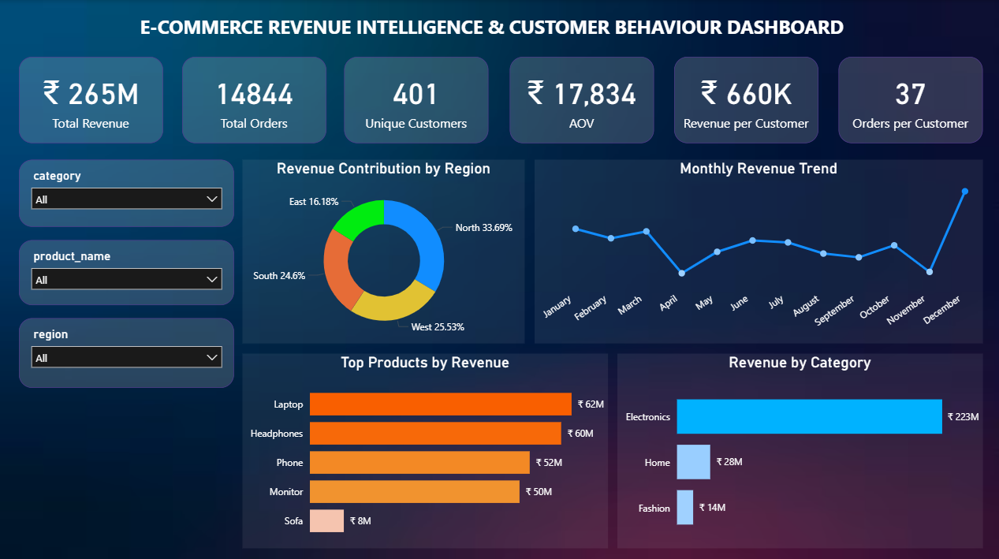

### Customer & Operational Insights

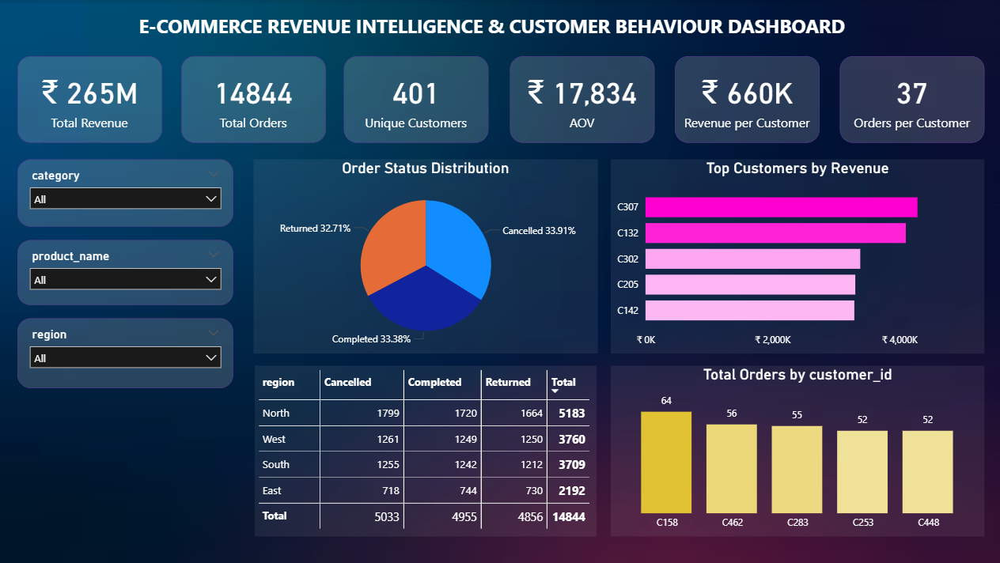

---

## 📈 Key Metrics

* Total Revenue → ₹264M+
* Total Orders → 14,844
* Unique Customers → 401
* Average Order Value → ₹17,834
* Revenue per Customer → ₹660K
* Orders per Customer → 37

---

## 🔍 Key Insights

### 🔹 Revenue Drivers

Revenue is heavily driven by the Electronics category, contributing over ₹223M. The top 3 products (Laptop, Headphones, Phone) contribute around 65% of total revenue, indicating strong product concentration and dependency on a few high-performing products.

---

### 🔹 Regional Performance

North region leads with ₹89M+ revenue, while East is the lowest performer. This shows a clear imbalance in regional performance and highlights growth opportunities in underperforming regions through targeted strategies.

---

### 🔹 Customer Behavior

With 401 customers generating ₹264M+, the business shows strong repeat purchasing behavior with high AOV. However, top customers contribute only ~7% of revenue, indicating a relatively diversified customer base.

---

### 🔹 Time Trends

Revenue peaks in December and is lowest in April, showing strong seasonal patterns. This suggests opportunities for aligning marketing and inventory strategies with high-demand periods.

---

### 🔹 Operational Insights

Cancelled (5033) and returned (4856) orders are close to completed orders (4955), indicating operational inefficiencies. Improving product quality, delivery experience, and customer satisfaction can significantly improve conversion rates.

---

### 🔹 Business Risk

The business faces product and regional concentration risks. While customer dependency is low, reliance on a few products and regions, along with high cancellations/returns, may impact long-term growth.

---

## 💡 Business Recommendations

* Diversify product focus beyond top-performing items
* Invest in underperforming regions (especially East)
* Improve customer retention strategies
* Reduce cancellations and returns through operational improvements
* Align marketing campaigns with seasonal trends

---
## 📸 Additional Analysis

---

## 🔹 1. Raw Data & Data Quality Issues

These images highlight the real-world messy nature of the dataset before cleaning.

### Raw Dataset Snapshot

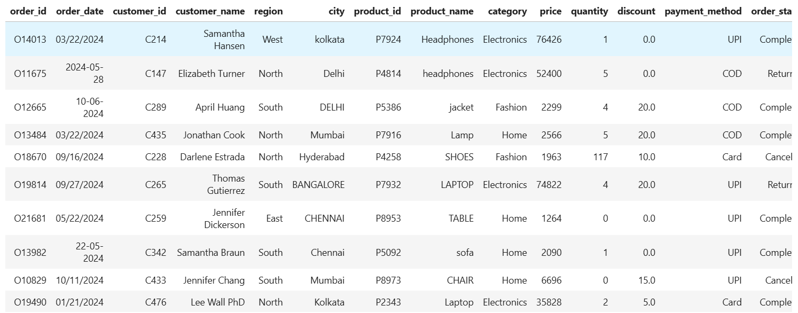

### Data Integrity Issues (Nulls, Duplicates, Inconsistencies)

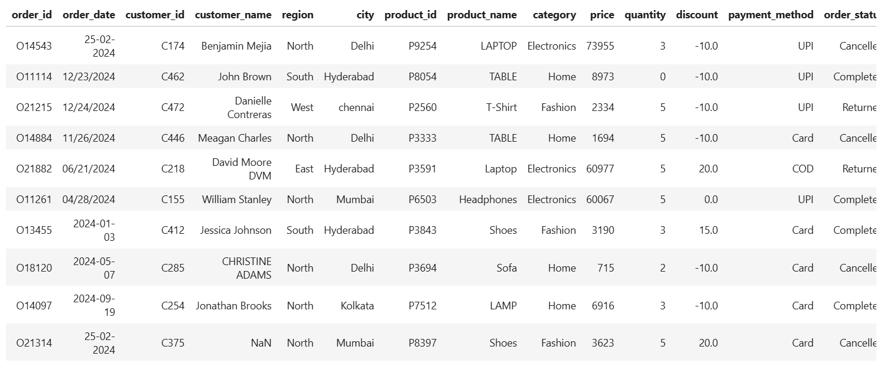

### Dataset Size & Structure

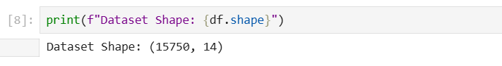

### Pre-Cleaning Data Summary

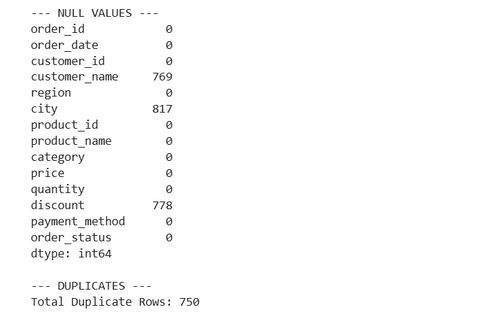

---

## 🔹 2. SQL Data Cleaning & Transformation

This stage shows how raw data was transformed into analysis-ready format.

### Final Cleaned Table (orders_final)

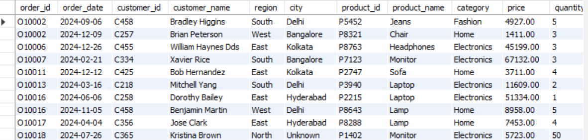

### Top Products (SQL Analysis)

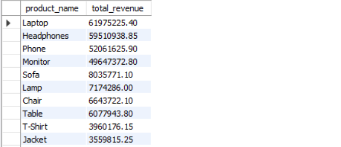

### Top Customers (SQL Analysis)

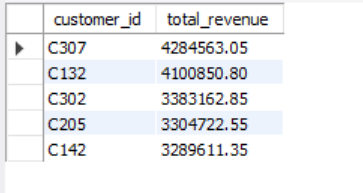

### Revenue by Region (SQL)

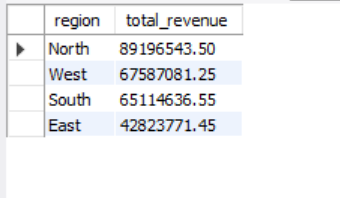

### Monthly Revenue Trend (SQL)

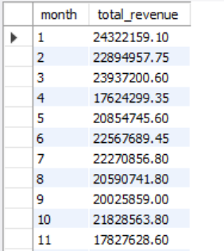

---

## 🔹 3. Python Analysis (Pandas)

Python was used for deeper analysis and validation.

### Data Preview in Python

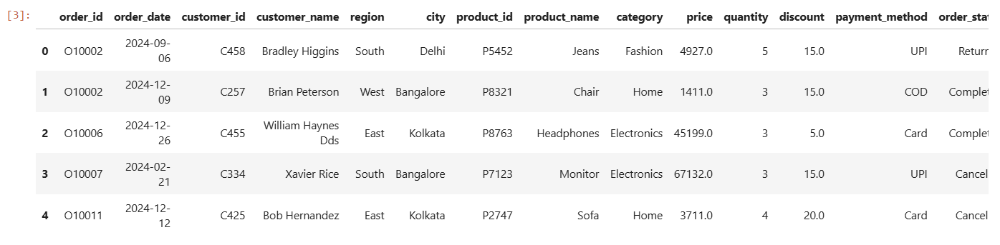

### Filtering Completed Orders (Correct Revenue Logic)

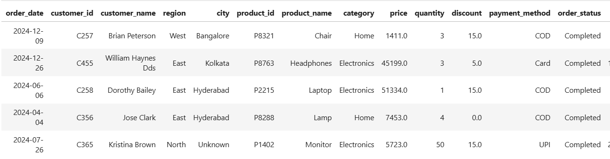

### Top Products (Python)

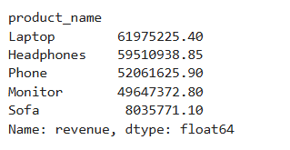

### Revenue by Region (Python)

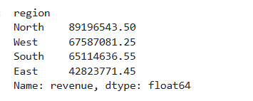

### Monthly Trend (Python)

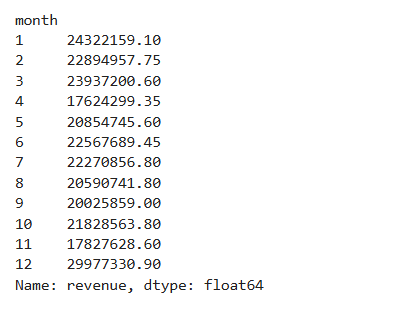

### Customer Behavior Analysis

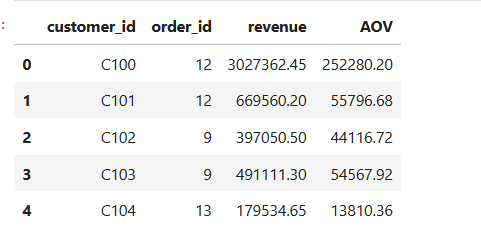

### Revenue Trend Visualization

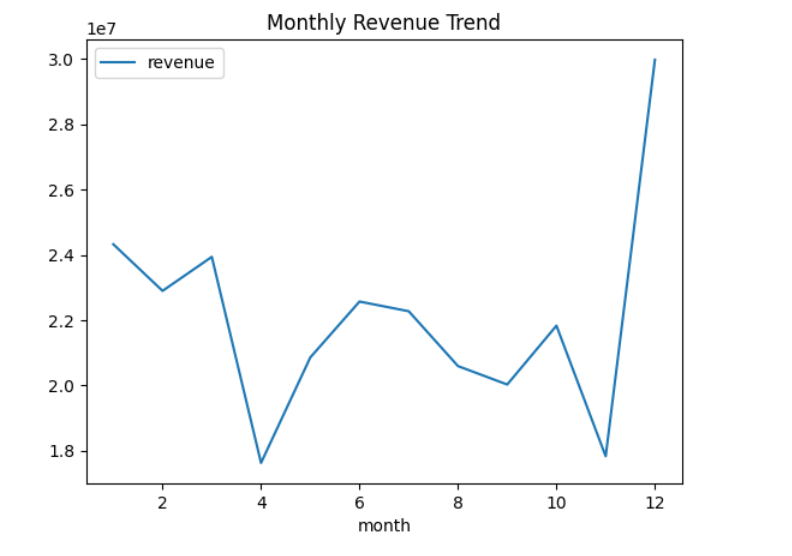

---

## 🔹 4. Excel Analysis & Validation

Excel was used to validate KPIs and create quick business summaries.

### Revenue by Product (Excel Pivot)

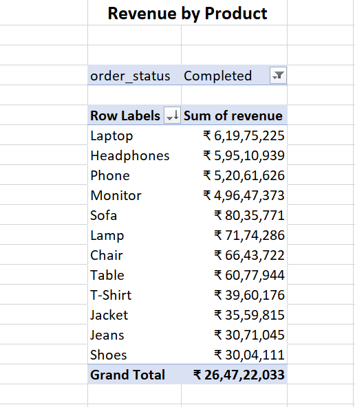

### Revenue by Region (Excel Pivot)

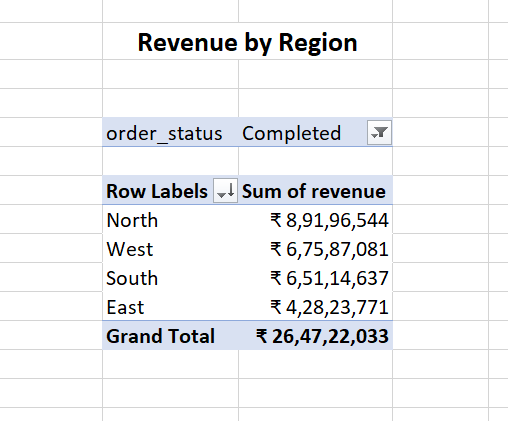

### Order Status Distribution

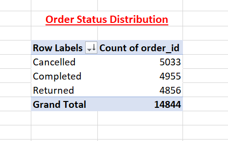

### Region vs Order Status Analysis

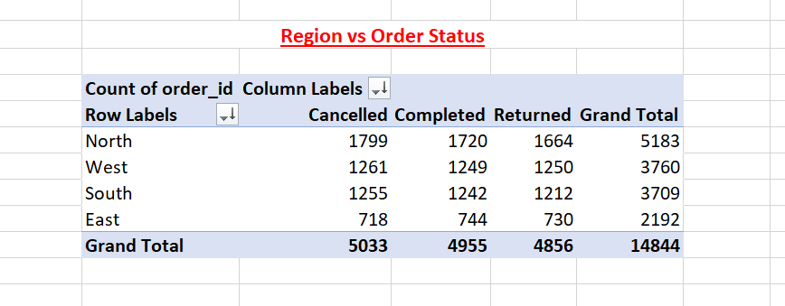

### Top Customers (Excel)

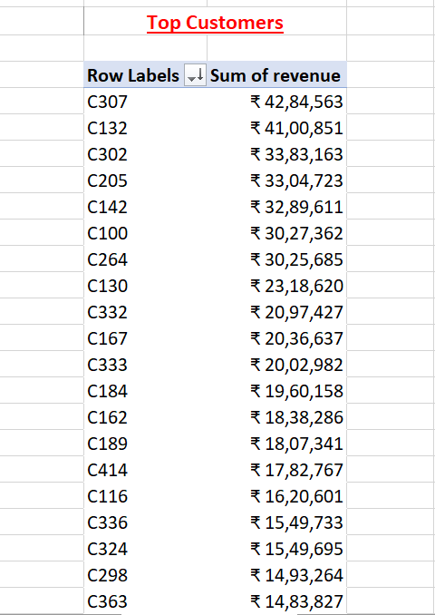

---


## 🚀 Conclusion

This project demonstrates an end-to-end data analysis workflow, from raw messy data to business insights and dashboard reporting. It highlights how data-driven decision-making can improve revenue, reduce risk, and optimize business performance.

---
